## 第一课：Quick Start

访问网站的过程，HTTP都做了什么？    

- 输入网址（web客户端发送HTTP请求报文，在地址栏输入的内容叫做URI，通常情况下都使用的是URL这种类型的地址，地址的内容包括了协议名称、web服务器名称、资源地址）
- 等待网站响应（通常情况下这个过程是比较短暂的，但web服务器却做的不少）
	- web服务器接收到请求以后，通过URL地址照到对应的资源，然后发送HTTP响应报文，响应的内容有：响应状态码、资源类型（MIME）、资源长度、资源内容。。。
	- web客户端接收响应信息，根据其中的资源类型对资源进行解析，并按照其格式显示为网页或其他资源类型
	
整个过程中，涉及到的知识：URL、HTTP状态码、MIME格式

一个单独的网页，通常情况下会有多个HTTP请求，包括HTML页面请求、页面的内嵌资源：如js、css文件、图片文件、视频音频文件等等    

HTTP报文只有两种：请求报文、响应报文；两种报文都是由简单的字符串组成，分为以下三个部分：

- 起始行（即报文的第一行）
	- 对于请求报文，起始行用于说明要做什么（HTTP方法、请求内容）
	- 对于响应报文，起始行用于说明出现了什么情况（响应状态码）
- 首部字段（起始行后面跟着的0个或多个名值对，用冒号分隔；首部以一个空行结束）
- 主体
	- 请求报文：要发送给服务器的数据（对于get请求就没有此内容）
	- 响应报文：返回给客户端的数据（可以是任何类型的文件，如HTML、Txt）

HTTP报文的转送——TCP/IP协议，HTTP协议建立在TCP协议之上，也就是说，在发送HTTP报文之前，web客户端与web服务器之间会通过URL建立一条TCP连接，建立的过程运用到DNS域名服务器解析。

使用Telnet命令建立TCP链接并测试HTTP请求的响应内容，模拟HTTP客户端。

web应用程序（除web浏览器、web服务器之外的）

- 代理（位于客户端和服务器之间，接收所有客户端的HTTP请求并转发给服务器，也就是代表客户端与服务器进行通信，代理可对请求和响应进行过滤）
- 缓存（将经过代理请求的文档复制保存起来，下一次访问时可直接访问副本）
- 网关（可将HTTP流量转换为其他协议）
- 隧道（对原始信息进行盲转发，通常用于加密）
- Agent代理（代表用户发起HTTP协议的应用程序，比如web浏览器、网络爬虫就是一种Agent代理）

## 第二课：URL

URL作为URI的一个子集，它主要通过资源的位置来进行标识资源；URI的另一个比较主要的子集URN则是通过名字来进行识别。

URL可分为三个部分：

- URL方案：此部分告知web客户端怎样访问资源，即使用什么协议，对于HTTP访问则是HTTP协议
- 服务器位置：此部分告知web客户端资源位于何处，可以是服务器域名也可以是IP地址
- 资源路径：此部分告知web客户端资源所在服务器本地的具体路径

具体来说：方案+主机+路径    
同时URL也可以通过其他的协议来访问资源。

URL语法:

<pre>
	方案://用户名:密码@主机:端口/路径;参数?查询字符串#页面片段
</pre>

对于HTTP协议，常用的是“主机:端口”、“路径:参数”、“查询字符串”、“页面片段”

URL的快捷方式：相对URL（在资源内部使用），关于如何在绝对URL和相对URL之间进行切换，需要涉及到基础URL，基础URL的位置有两种提供方式：
	
- 资源中显示提供：通过<base>标签指定页面中所有相对URL的基础URL
- 封装资源的基础URL：当没有显示指定时，一般将该资源的所属资源的URL作为基础URL
- 无基础URL：此时则会出现问题，该URL无效

相对URL的解析过程可用如下的流程图解释：
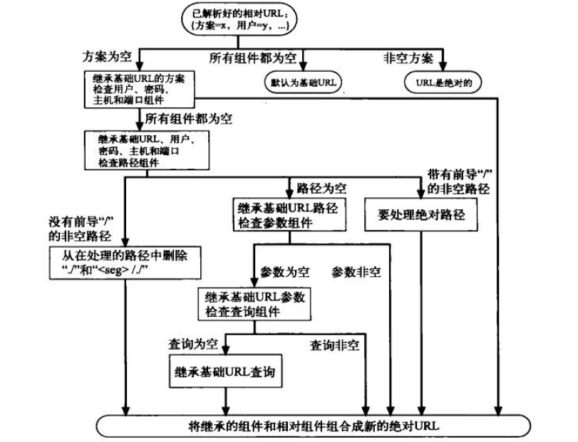

自动扩展URL功能：

- 主机名扩展
- 历史扩展

URL编码机制：ASCII码+转义字符，转义字符用来表示不安全字符，同时有一些被保留受限的一些字符：
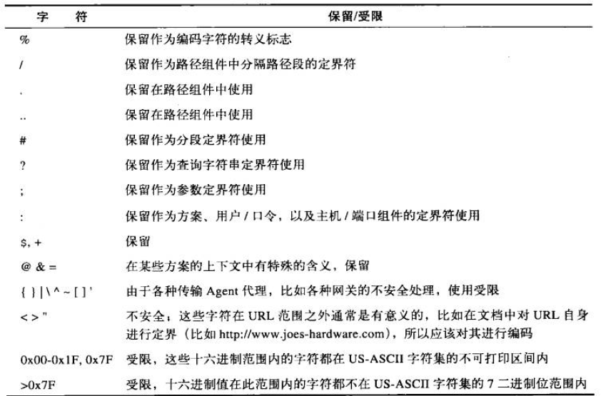

## 第三课：HTTP报文

请求报文的语法格式：

	<方法> <请求URL> <版本>
	<首部信息>
	<主体信息>

响应报文的语法格式：

	<版本> <状态码> <原因短语>
	<首部>
	<主体>

常用的**HTTP方法**：

- GET：从服务器获取资源
- POST：向服务器发送数据
- PUT：将主体信息储存在服务器
- DELETE：从服务器删除资源
- OPTIONS：决定可以在服务器执行哪些方法
- HEAD：只从服务器获取文档的首部
- Trace：追踪

并不是所有的浏览器都实现了衣裳的几种方法。在这些方法中，GET和HEAD方法被视为安全方法，即不会在HTTP服务器产生什么影响，GET和HEAD的区别就在于，HEAD请求的响应只返回首部的内容，而不返回主体。

使用HEAD请求的作用有：

- 在不获取资源的情况下查看资源的相关信息
- 通过查看响应码判定资源是否存在
- 通过查看首部测试资源是否被修改

除这些HTTP方法外，HTTP还支持扩展方法，可以自己编写HTTP扩展方法实现一些现有HTTP标准方法所不能实现的功能，如MOVE方法可以移动服务器资源

HTTP**响应状态码**：
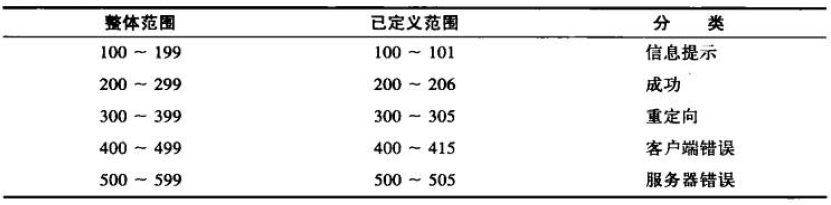
最常见的两种状态码：200（成功）、404（NOT FOUND）

100 continue状态码用于当客户端想要向服务器端发送大容量的主体时才使用，且只有HTTP1.1版本才支持此状态

300重定向状态码，通过响应报文的location首部可告知资源的新位置

400范围为客户端错误状态码，500范围为服务器端错误状态码

**HTTP首部**字段：向请求信息或响应信息添加一些附加说明的内容，一般以名值对的形式出现，首部可分为通用首部（请求报文和响应报文都有的，如DATE）、请求首部、响应首部、实体首部、扩展首部，

常用的首部有：Date、Content-length、Content-type（用于描述实体内容，为实体首部）、Accept（客户端希望接受什么类型的资源，请求首部）

请求首部分为：Accept首部、条件请求首部、安全请求首部、代理请求首部    
响应请求首部：协商首部、安全响应首部    
实体首部：内容首部（content系列）、实体缓存首部

## 第四课：连接管理

HTTP连接是HTTP报文传输的关键通道，在编写HTTP应用程序时必须对此有深刻的理解。几乎所有的HTTP连接都是TCP链接，TCP连接是因特网上的可靠连接。从浏览器接收到用户输入的网址时，首先要建立TCP连接，其过程分为以下几个步骤：

- 从URL中解析主机名
- 查询主机名的IP地址（DNS）
- 获取端口号（默认为80）
- 发起到某IP的某端口的连接
- 浏览器发送HTTP请求报文
- 浏览器读取HTTP响应报文
- 关闭连接

TCP为HTTP提供一条可靠的的比特传输管道，使得从TCP一端输入的字节在另一端以原有的顺序正确的传送出来。TCP数据又是通过IP分组的小数据块来发送的，因此整个协议栈即HTTP over TCP over IP，HTTP的安全版本HTTPs就是在HTTP与TCP的中间插入了一层（TLS或SSL）的密码加密层。

TCP通过四个值识别应用程序：
<源IP地址> <源端口号> <目的IP地址> <目的端口号>    
这四个值唯一标志了一条TCP连接，两个不同的连接不可能四个值都相同。

TCP套接字编程：
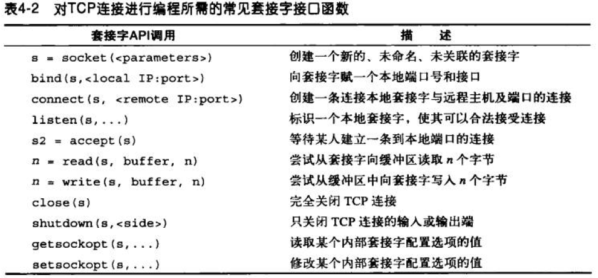

HTTP连接的性能问题：HTTP位于TCP端的上层，因此TCP端的性能问题会直接影响到HTTP的性能，对于一次HTTP连接来说，产生的时延主要有以下几种情况：

- 查询服务器IP地址和端口号的时延（DNS）
- 建立TCP连接的时延
- 服务器处理报文的时延
- 服务器会送报文的时延

TCP握手时延：当小的HTTP事务会在TCP握手时延上耽搁过多的时间

**HTTP连接处理**：

HTTP的Connection首部：通过一个由逗号分隔的连接标签列表来为连接指定一些不会传播到其他连接中去的选项，这些标签可分为下列3类：

- HTTP首部字段名，列出只与此连接有关的首部，转发之前必须删除列出的首部
- 任意标签值，用于描述此连接的非标准选项
- 值close，说明操作完成之后须关闭这条持久链接

串行连接会将时延叠加起来，因此性能极差，以下几种方法可以提高HTTP连接性能：

- 并行连接：如加载一个页面时，并行发起几个连接分别用于请求HTML页面以及内嵌的一些资源。并行连接的缺点：占用内存，在网速较慢时不一定就比串行速度快，TCP慢启动的存在使得新连接的传输速度慢，可打开的并行连接数量是有限的。
- 持久连接：在事务处理结束后仍然保持TCP连接，缺点：可能导致大量空闲连接（Keep-Alive）通过Connection：Keep-Alive首部可请求一条连接保持在打开状态，如果服务器端可以打开一条持久连接则在响应报文的首部加上Connection：Keep-Alive。Keep-Alive选项：timeout，keep-alive响应首部中服务器希望将连接保持活跃的时间；max，希望为多少事务保持连接活跃。Keep-Alive选项是可选的，只有在Connection：Keep-Alive首部存在时才可用。
- 管道化连接：管道化连接是建立在持久连接上的，如果不能保证是持久连接就不能请求管道化连接
- 复用连接

连接的关闭：

- 任意解除连接，这种情况可能发生在资源传输尚未完成时，此时就要依靠响应报文中的Content-length首部进行判定是否资源是完整的，所以每条HTTP响应报文都应该有精确的Content-length首部。

	事务分为幂等和非幂等，幂等的事务表示不论执行多少次，结果都相同，而非幂等则相反。客户端不应该以管道化方式传送非幂等的事务请求。

- 正常关闭连接，TCP连接有两条信道（输入和输出），使用套接字调用close方法会将两条信道都关闭，成为完全关闭；也可调用shutdown方法关闭其中的一条，称为半关闭。关闭连接的输出信道相对安全，而关闭输入信道则比较危险。

	要实现正常关闭，一般应首先关闭输出信道，然后等待它的另一端关闭其输出信道，然后再完全关闭

## 第五课：Web服务器

Web服务器的形式：

- 可安装在系统上的软件web服务器（如Apache、iPlanet）
- web服务器设备（一台预先安装好服务器软件的计算机）
- 计算机芯片嵌入式web服务器（一般潜入消费类产品，如打印机）

web服务器会做什么：

- 建立连接——接受客户端连接或关闭连接
- 接收请求——从网络中读取HTTP请求报文
- 处理请求——对请求报文进行解释，并采取行动
- 访问资源——访问报文中指定的资源
- 构建响应——创建带有正确首部的HTTP响应报文
- 发送响应——将响应发送给客户端
- 记录事务处理过程——将已完成的事务记录在日志中

新连接的建立：建立连接——判断客户端IP——添加至连接列表——监视连接

服务器的分类：

- 单线程的web服务器：一次只处理一个事务知道结束
- 多进程/多线程的web服务器
- 复用I/O的服务器
- 复用的多线程web服务器

资源映射：web服务器是一种资源服务器，它负责发送预先创建好的或者动态生成的内容，在发送资源以前web服务器要通过URI将请求内容映射为web服务器上的内容或内容生成器。web服务器支持多种资源映射，最简单的一种就是通过URI指定的文件名对web服务器上的文件进行访问。

docroot：web服务器有一个专门的文件夹用于存放web内容，这个文件夹叫做docroot（文档根目录），web服务器从请求报文中获取URI并将其附加在docroot后面。通过配置DocumentRoot可以设置web服务器的虚拟托管根目录。

目录列表：当URI解析为一个目录而非一个文件时，web服务器的处理可有一下几种

- 返回一个错误
- 不反悔目录，返回一个特殊“索引文件”
- 扫描目录，返回一个目录HTML页面（该目录中的文件及其链接，可通过设置禁止）
- 返回该目录中index.html或者index.htm的文件，也可以通过设置来改变这一默认文件名

响应报文：MIME类型的确定，通过扫描文件的扩展名来确定其MIME类型；除此之外还有：魔法分类、显示分类、类型协商。

重定向响应：响应报文首部包含location字段，说明替代URI或优选URI，通常重定向的情况有如下几种

- 永久删除的资源：状态码301
- 临时删除的资源：状态码303或307
- URL增强：状态码303或307
- 负载均衡：状态码303或307
- 服务器关联：303或307
- 规范目录名称

## 第六课：代理（网络的中间实体）

web代理服务器既是web服务器又是web客户端，与web客户端交流时它扮演web服务器的角色，与web服务器交流时它扮演的是web客户端的角色，因此它应该具有发送请求报文和接收和处理请求报文并返回响应报文的能力。

代理的分类：

- 公共代理
- 私有代理

代理与网关的区别：代理连接的是使用相同协议的应用程序，而网关连接的是使用不同协议的端点，扮演的是“协议转换器”的角色

代理的作用：

- 儿童过滤器
- 文档访问控制
- 安全防火墙
- web缓存
- 反向代理
- 内容路由器
- 转码器
- 匿名者
	- 从User-Agent首部删除用户计算机与OS类型
	- 删除From首部以保护用户Email地址
	- 删除Referer首部以掩盖用户的访问痕迹
	- 删除Cookie首部以剔除概要信息和身份数据

代理部署：

- 出口代理：将代理固定在本地网络的出口点，以控制本地网络与大型因特网之间的流量，起到防火墙、过滤器或提高因特网流量的作用。
- 访问（入口）代理：放置于ISP访问点上，处理客户的聚合请求，起到缓存提高速度的作用。
- 反向代理：部署在网络边缘，作为web服务器的替代物使用，可提高web服务器的安全特性和性能。
- 网络交换代理：放置于网络之间的因特网对等交换点上，通过缓存可减轻因特网节点的拥塞。

代理的层次结构：下一个入口代理（靠近服务器）被称为父代理，下一个出口代理（靠近客户端）被称为子代理。

客户端流量流向代理的几种情况：

- 修改客户端
- 修改网络
- 修改DNS命名空间
- 修改web服务器

代理配置：

- 手工配置
- 预先配置浏览器
- 代理的自动配置
- WPAD的代理发现

代理请求的问题：

- 客户端向服务器和代理发送请求报文时的URI是不同的，在想服务器直接发送时URI只为部分URI（没有方案和主机名），而向代理发送时则是完整的URI
- 缺少“方案/主机/端口”：请求报文需要完整的URI
- 拦截代理会收到部分URI，如反向代理；
- 代理既可以处理代理请求，也可以处理服务器请求
	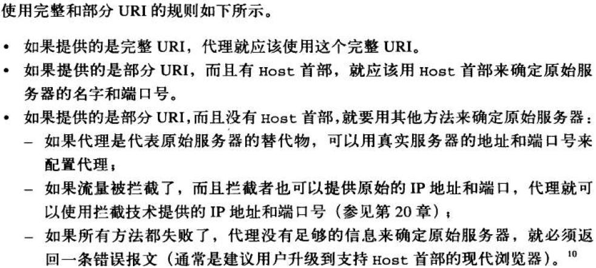
- 转发过程中对URI的修改
- URI客户端自动扩展和主机名解析
	- 没有代理时URI的解析
	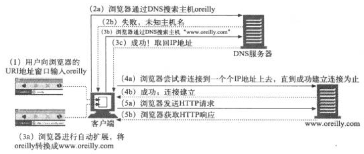
	- 有显示代理时的URI解析
	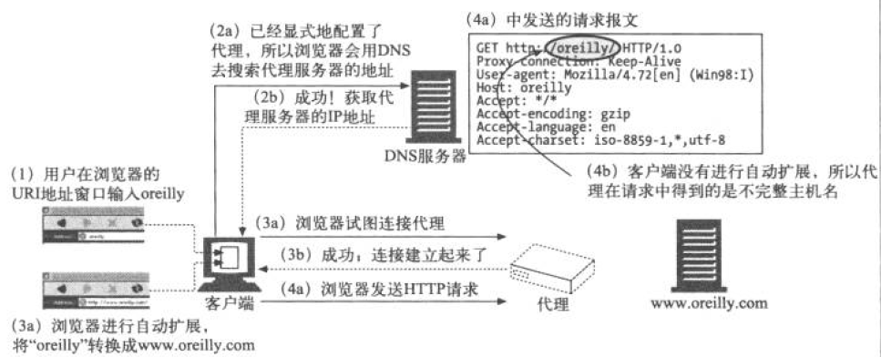
	- 有拦截代理时的URI解析
	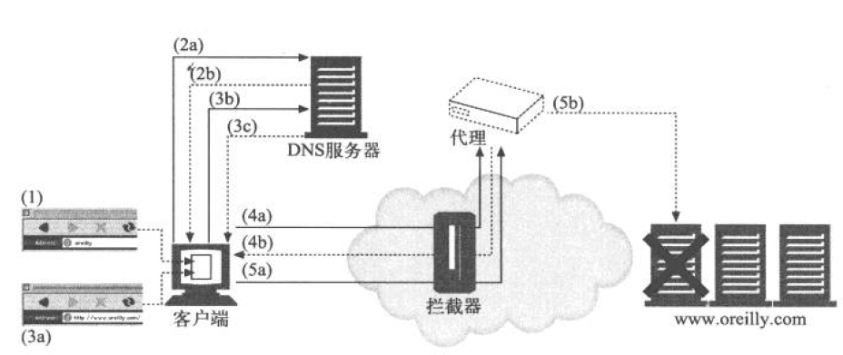

追踪报文：

- via首部列出了报文途径的每个中间节点（代理或网关）的相关信息，其包含一个由逗号分隔的路标，每个路标都代表一个代理服务器或网关；每个路标最多包含4个组件：可选的协议名（默认HTTP）、必填的协议版本、必选的节点名、可选的描述性注释。请求报文的via首部通常情况下会与响应报文的via首部相反。
- Server首部对原始服务器使用的软件进行了描述。
- TRACE方法：
	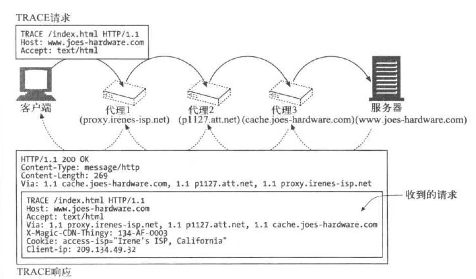

代理认证：

## 第七课：缓存

缓存的优点：

- 减少冗余的数据传输，节省网络费用
- 缓解了网络瓶颈问题，不需要更多的宽带就可以更快地加载页面
- 降低了对原始服务器的要求，服务器可以更快地响应，避免过载
- 降低了距离时延

HTTP再验证：原始服务器的内容会发生变化，缓存要不时对其进行检测，看他们保存的副本是否是服务器上最新的版本，又称为“新鲜度检测”，验证时会向原始服务器发送一个小的再验证请求，如果内容没有变化则服务器会以一个小的304 Not Modified进行响应。验证方式最常见的就是给GET请求添加If-Modified-Since首部，服务器收到此请求的响应情况有如下三种：

1. 再验证命中：响应304 Not Modified
2. 再验证未命中：响应一条完整的带有内容的 200 OK响应
3. 对象被删除：回送一个404 Not Found响应

成功的再验证比缓存未命中要快，失败的再验证几乎与未命中速度一样。

*缓存命中率*    
	由缓存提供服务的请求所占比例成为缓存命中率。    
*字节命中率*    
	缓存提供的字节在传输的所有字节中所占的比例。    

以上两种指标用于评估缓存性能。

区分缓存命中与未命中：使用Date首部，将Date首部与当前时间进行比较，如果响应中的时间较早通常可以认为这是缓存命中；同时也可以使用Age首部进行判断。

缓存的分类：私有缓存、公有缓存（或称代理缓存）

代理缓存具有拓扑结构：层次型、网状

*缓存的处理步骤*

1. 接收——缓存从网络中读取请求报文
2. 解析——从报文提取URI以及各种首部
3. 查询——查看是否有本地副本，如果没有则获取一份副本并保存在本地
4. 新鲜度检测——查看已缓存副本是否新鲜，如果不是则询问服务器是否有更新
5. 创建响应——使用新的首部和已缓存的主体构建一条响应报文
6. 发送——缓存通过网络将响应报文发送给客户端
7. 日志——缓存可选地创建一条日志来描述这一事务
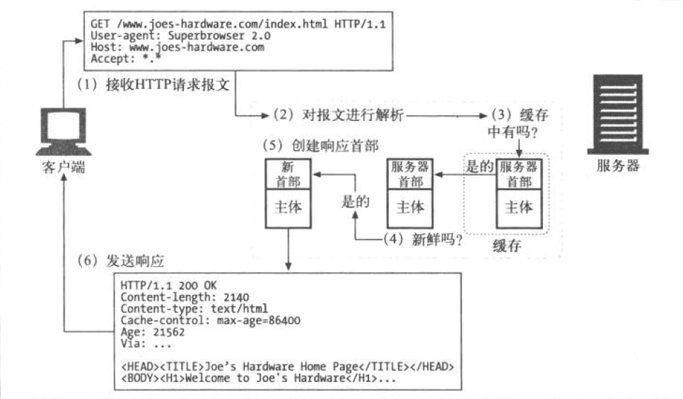

*保持副本的新鲜*

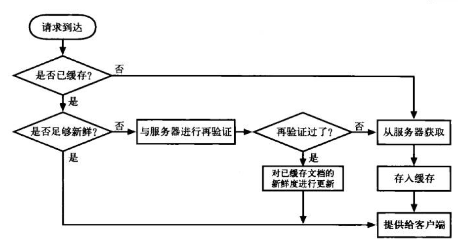缓存Get请求的过程

- 文档过期：通过特殊的HTTP Cache-Control首部和Expires首部说明副本的“保质期”，在规定的保质期内可以随意的使用副本而无须向服务器进行确认，一旦超过保质期则需要向服务器确认最新的副本。    
	Cache-Control：max-age定义了文档的最大生存期，以秒为单位    
	Expires：指定一个绝对的过期日期
- 服务器再验证：已过期的文档不一定就与服务器上的文档有差异，因此需要验证，如果验证发现文档内容发生了变化则获取一份新的副本并将其存在旧文档的位置上发送给客户端；如果验证发现没有变化，只需要获取新的首部，包括一个新的过期日期并对缓存中的首部进行更新即可。
- GET条件方法实现再验证：两个最有用的条件方法首部If-Modified-Since：<date>以及If-None-Match：<tags>
	- If-Modified-Since：Date再验证，此类验证请求又称为IMS请求。如果自指定日期后文档被修改了，If-Modified-Since条件则为真，GET请求就会成功执行并携带新首部新文档被返回给缓存，新首部还包含一个新的过期日期；否则条件为假，返回304，只返回响应首部而不返回主体部分
	- If-None-Match：Tags实体标签再验证，实体标签是附加到文档上的任意标签，当发布者对文档进行修改时可以同时修改这些实体标签来说明。此类验证通过对比实体标签来查看文档是否被修改了。

强弱验证器：弱验证器允许文档被少量修改而不更改缓存副本。

*缓存能力的控制：*

- no-Store & no-Cache首部：这两个首部用于防止缓存提供未经证实的已缓存对象，其中no-Store的响应会禁止缓存对响应进行复制；no-Cache的响应虽然可以缓存在本地，但必须经过新鲜度再验证之后才可以提供给客户端
- max-age首部：规定保质期
- Expires首部：规定绝对过期时间
- must-revalidate首部：告诉缓存在没有跟原始服务器进行验证的情况下不能提供这个对象的陈旧副本
- 试探性过期：当没有max-age和Expires首部时，缓存会计算出一个试探性的最大使用期。常见的算法有LM-Factor算法
- 客户端的新鲜度控制：强制刷新Refresh和重载Reload

*缓存控制设置：* 略

## 第八课：集成点 ：网关、隧道、中继

###网关：连接HTTP及其他协议和应用程序的接口

网关是资源与应用程序之间的粘合剂，可以像数据库发送查询语句，也可以生成动态内容，也可以自动将HTTP流量转化为其它协议。

web网关通常在一侧使用HTTP协议，在另一侧使用其它协议，通常可以描述为如下形式：

	<客户端协议>/<服务器端协议>

通常网关可分为：

1. 服务器端网关：通过HTTP与客户端对话，通过其他协议与服务器通信(HTTP/*)
2. 客户端网关：通过其他协议与客户端对话，通过HTTP协议与服务器通信(*/HTTP)

将HTTP流量导向网关的方法与将流量导向代理的方法一样，可以显示地配置浏览器使用网关，或者将网关配置为替代者。

各种web网关介绍：

1. HTTP/*：服务器端web网关——当请求流入原始服务器时，网关将客户端的HTTP请求转化为其他协议。
2. HTTP/HTTPS：服务器端安全网关——对所有的输入请求加密
3. HTTPS/HTTP：客户端安全加速器网关——接收安全HTTPS流量并进行解密，然后向服务器发送普通HTTP请求

资源网关介绍：

1. 通用网关接口CGI：用于装载程序以响应对特定URL的HTTP请求，并收集程序的输出数据，将其放在HTTP响应中回送。

###隧道：使HTTP应用程序访问到非HTTP协议的应用程序

HTTP隧道的建立：CONNECT方法
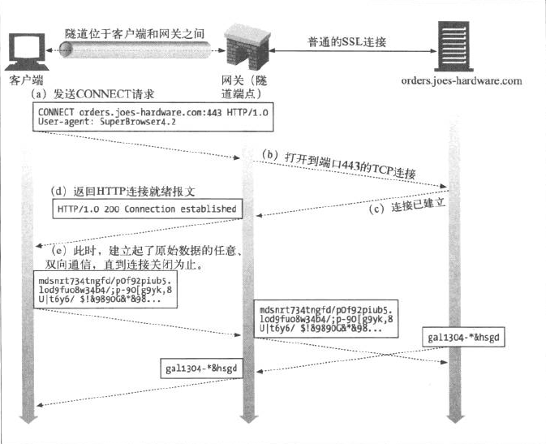
CONNECT方法与其他HTTP方法类似。

* SSL隧道

###中继：没有完全遵守HTTP规范的简单HTTP代理

中继用于处理HTTP中建立连接的部分，对字节进行盲转发

## 第九课：Web机器人

web机器人是能够在无须人类干预的情况下自动进行一系列web事务处理的软件程序。

* web爬虫    
	网络爬虫会递归地对各种信息型web站点进行遍历，获取第一个web页面，然后获取该页面指向的其他页面，然后是那些页面的指向页面，以此类推。    
	爬虫开始访问的URL初始集合被称为根集，根集的挑选应该从足够多的不同的站点中去选取，好的根集通常包含一些大的流行站点。    
	爬虫在web上移动时会不停地对HTML页面进行解析，提取出其中的链接并添加到需要爬行的链接列表中去，也需要将相对URL转换为绝对形式。    

	避免环路的出现导致暂停或减缓爬虫的爬行进程，概括来说环路对爬虫的危害分为以下三点：   
		1. 使得未经良好设计的爬虫不停兜圈子，把时间耗费在获取相同的页面上，浪费网络宽带，也无法获取其他页面   
		2. 爬虫不断获取相同页面也会对web服务器造成打击，阻止真实用户访问这个站点   
		3. 爬虫应用程序会被大量重复的内容充斥而变的毫无用处。

	由于web上URL的数量庞大，这要求爬虫具有高效的搜索速度和存储管理：    
		1. 树和散列表    
		2. 有损的存在位图    
		3. 检查点    
		4. 分类

	URL别名：两个URL看起来不一样但实际指向同一资源。URL别名会导致爬虫无法识别页面是否是已访问过的页面，而造成回路，因此大多数机器人都会试图将URL进行规范化：    
		1. 如果没有指定端口，则加上默认端口80    
		2. 将所有转义符%XX都转化为等价字符    
		3. 删除#标签

	一些常用的网络爬虫技术：    
		1. 规范化URL   
		2. 广度优先的爬行   
		3. 节流   
		4. 限制URL的大小   
		5. URL站点黑名单   
		6. 模式检测   
		7. 内容指纹   
		8. 人工监视

* 机器人HTTP

	* 首部	
	
		大部分机器人倾向于支持最小的HTTP集，但建议提供如下首部：   

		* User-Agent：发起请求的机器人名字
		* From：提供机器人的用户/管理者的Email
		* Accept：可接受的媒体类型
		* Referer：提供包含当前请求URL的文档的URL

	* 虚拟主机：HTTP1.1要求爬虫提供Host首部
	* 条件请求：尽量减少机器人所要获取内容的数量，使得只在内容发生变化时才获取内容，一些机器人对时间戳或实体标签进行比较，看它最近获取的版本是否已经升级。
	* 对响应的处理：
		* 状态码：机器人应该至少能够识别200和404状态码
		* 实体：

* 行为不当的机器人
	* 失控机器人：向web服务器发出大量的负载——使得服务器过载并拒绝向其他人提供服务。
	* 失效的URL：向大量不存在的URL发出请求
	* 很长的错误URL：向服务器请求一些很大的、无意义的URL
	* 爱打听的机器人：请求指向私有资源的URL
	* 动态网关访问：获取内容来自网关的URL

###拒绝机器人访问

###机器人规范

###搜索引擎

## 第十课：HTTP-NG

###HTTP的缺陷

* 复杂性：HTTP功能的复杂性导致要正确地实现HTTP非常困难
* 可扩展性：HTTP很难实现递增式扩展，这使得许多HTTP应用程序无法与协议的扩展兼容
* 性能：HTTP中存在一些低效性，在高时延、低吞吐的无线访问中会更严重
* 传输依赖性：目前的HTTP依赖于TCP/IP协议，可替代协议的工作非常少

###HTTP-NG分层

HTTP-NG的主题：模块化与功能增强，它将HTTP协议模块为三层

* 报文传输层：不考虑报文功能，只致力于端点间报文的不透明传输
* 远程调用层：定义请求/响应功能，提供对服务器资源的操作
* Web应用层：提供大部分内容管理逻辑，包括HTTP方法和首部的定义

HTTP-NG的许多功能原理都借鉴了分布式对象

###提高报文传输性能WebMUX

* 对报文进行管道化、批量化传输，降低往返时延
* 重用连接，降低时延，提高传输宽带
* 同一条连接上复用多个报文流
* 对报文进行有效分段，使报文边界更易确定

###WebMUX协议

WebMUX协议的设计目标：

* 设计简单
* 高性能
* 复用
* 基于信用的流量控制
* 保持对齐
* 丰富的功能

###二进制连接协议

HTTP-NG提倡在远程调用层采用二进制连接协议，二进制连接协议通过一条有状态的连接承载了从客户端发往服务器的操作调用请求，以及从服务器端发往客户端的操作结果应答。请求报文中包含操作、目标对象和可选的数据值。应答报文带回操作的最终状态、所对应的请求序列号以及可选的返回值。

---

## 第十一课：客户端识别与cookie机制

###承载用户身份信息的HTTP首部

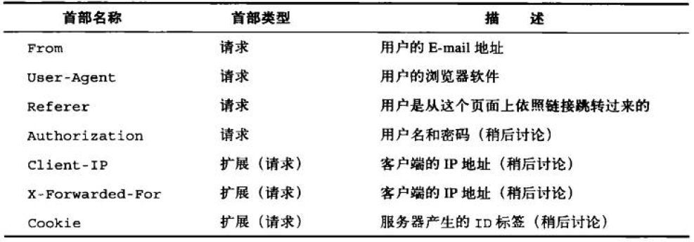

为了杜绝垃圾邮件的发送，一般通过From识别客户比较少。
User-Agent：可用与实现定制内容与特定的浏览器及其属性间的良好互操作。
Referer：可用此首部分析用户的兴趣所在

###客户端IP地址跟踪

通过TCP连接寻找到客户端IP地址，其缺陷在于：

* 客户端IP地址识别的是机器而非真正的用户，当多用户使用同一台机器时则无法区分
* 一些因特网服务提供商会为用户动态分配IP地址，这导致一个IP不一定能标识一个用户
* 为提高安全性，许多用户使用防火墙NAT访问网络，这时NAT会隐藏用户的真实IP而统一显示一个共享的防火墙IP
* HTTP代理和网关会打开一些新的到服务器的TCP连接，此时服务器获取的IP是代理或网关的IP而不是客户端的IP

以上缺陷导致使用客户端IP识别用户无法精确和安全。

###用户登录，认证方式

web服务器可以显示地让用户输入用户名和密码来识别用户，HTTP中的www-Authenticate首部和Authorization首部向web站点发送用户信息。过程如用户请求时，服务器先回送一条401 Login Required响应，浏览器显示登陆对话框，用户登录之后会重复发送一次请求，并在这一条请求中添加Authorization首部等登陆信息。

###胖URL

web站点通过为用户生成特定的版本的URL来追踪用户身份，通常是扩展URL，在URL开始或结束的地方添加一些状态信息。在用户首次访问时生成一个唯一的ID，并用服务器能够识别的方式将这个ID添加到URL中去，在下一次访问时服务器会将客户端重导向这个URL。这种技术的缺点是：

* 丑陋的URL
* 无法共享URL：将此URL发送给别人则可能泄露自己的私人信息
* 破坏缓存
* 额外的服务器负荷：服务器需要重写HTML使URL变胖
* 逃逸口：只有当用户严格追随预先修改过的链接时，胖URL才能正常工作，中途逃离的用户可能会丢失信息
* 在会话间是非持久的

###cookie

**cookie类型**：

* 会话cookie：一种临时cookie，记录用户访问站点时的设置和偏好，用户退出浏览器时此cookie则被删除
* 持久cookie：生存时间更长，存储在硬盘上，通常用户维护用户会周期性访问的站点配置文件或登录名。

两种cookie的唯一区别就是过期时间。

cookie中包含了一个由*名=值*这样的信息构成的任意列表，服务器通过Set-Cookie或Set-Cookie2HTTP响应首部贴在用户身上。一般此cookie中只包含一个服务器为了进行跟踪而产生的独特的识别码，但cookie实际可以储存许多信息。浏览器会将服务器响应的cookie记录在其cookie数据库中，当用户再次方位该网站的时候会自动将该cookie贴在用户身上。

* cookie的域属性：产生cookie的服务器可以向Set-Cookie首部添加一个Domain属性来控制哪些站点可以看到那个cookie
* cookie路径属性：path属性允许用户将cookie与web站点关联起来

**cookie版本**

* cookie版本0：
	
		Set-Cookie：name = value [; expires = date] [; path = path ] [; domain = domain] [; secure]
		Cookie: name1 = value1 [; name2 = value2]...
Set-Cookie首部有一个强制的cookie名和cookie值，后面跟着可选的属性：

	* expires指定cookie的实际生存期，日期格式为Weekday, DD-Mon-YY HH:MM:SS GMT,如没有指定此属性则默认会话结束时过期。
	* domain指定浏览器发送cookie的域，如果没有指定，则默认为发送Set-Cookie首部的服务器主机名
	* path为服务器特定文档分配cookie，如没有指定则默认为响应的路径
	* secure表示只有在SSL安全连接时才发送cookie

* cookie版本1：

	改动内容：
		
	* 为cookie关联上解释文本，对其目的进行解释
	* 允许在浏览器退出时强制销毁cookie
	* 使用相对秒数而不是绝对时间来指定cookie的Max-Age
	* 通过URL端口号，而不仅仅通过域和路径来控制cookie的能力
	* 通过cookie首部回送域、端口和路径过滤器
	* 为实现互操作性使用版本号
	* 从cookie首部从名字中分区附加关键字$前缀

	添加的Set-Cookie2首部属性：

	* Version：强制为1，表示cookie的版本
	* Comment：说明服务器如何使用此cookie
	* CommentURL：提供cookie使用说明的文档
	* Discard：表示在客户端程序终止时，指示客户端放弃这个cookie
	* Max-Age：设置秒数的生存期
	* Port：端口号设置

**cookie与会话跟踪**

**cookie与缓存**

处理cookie与缓存的一些规则：

* 将无法缓存的文档标示出来：一般标示Cache-Control：public即可
* 缓存Set-Cookie首部时要谨慎

**cookie安全性与隐私**

## 第十二课：基本认证机制

###认证

* HTTP质询/响应认证框架

	当服务器收到一条请求报文时，首先以一个“认证质询”进行响应并要求用户提供一些保密信息来说明他是谁，用户再次发起请求时要附上保密证书（用户名和密码），如果认证匹配则正常完成请求，否则服务器就再次质询或返回一条错误信息。
* 认证协议与首部

	HTTP有两个官方的认证协议：基本认证、摘要认证   
	不同的认证协议对应有不同的定制首部，对于基本认证来说，其定制首部如下

	* WWW-Authenticate 在认证的第二步骤——质询中，服务器根据不同的区域在此首部对保护区域进行描述，同时也指定认证算法，此时的返回状态是401
	* Authorization 在认证的第三步——授权，客户端再次发起请求，并在请求报文中添加此首部，用来说明认证算法和用户名/密码
	* Authentication-Info 在认证的最后一步成功情况下，服务器将文档返回，有时会在此首部提供一些授权会话的相关信息
	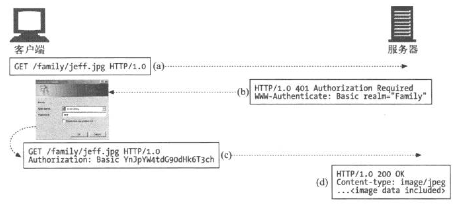
* 安全域

	在服务器向用户发出质询的时候，响应报文的WWW-Authenticate首部有一个realm指令则用于指定安全域的名称。通常服务器会将受到保护的文档组织成一个安全域，每个安全域对应不同的授权用户集。

###基本认证

基本认证的首部：

* WWW-Authenticate：Basic realm=XXX
* Authentication：Basic base64-username-and-password，基本认证会将冒号分隔的用户名:密码转化为Base-64密码

**代理认证**

可以在代理服务器上对访问策略进行集中管理，通过代理提供对内部资源的统一访问控制是非常便捷的，此过程的第一步就是代理认证，代理认证的过程与服务器认证类似，首部有所区别：
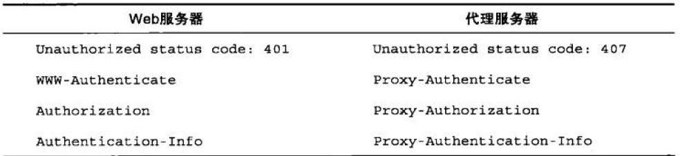

###基本认证的缺陷

* 基本认证通过网络发送的用户名和密码非常容易被解码窃取
* 第三方用户可以截取被修改过的用户名密码反复重放给服务器以获得对服务器的访问权限
* 对于使用重复密码的用户十分危险
* 没有提供任何针对代理和中间节点的防护措施
* 假冒服务器很容易骗过基本认证

## 第十三课：摘要认证

基本认证虽然便捷灵活但极不安全，而摘要认证可兼容基本认证同时也更加安全。

###摘要认证的改进

* 永远不以明文方式在网络上发送密码
* 可防止恶意用户捕获并重放认证的握手过程
* 可有选择地防止对报文内容的篡改
* 防范其他几种常见攻击

**摘要保护密码**

在摘要认证中，客户端不会发送密码，而是发送一个“指纹”或密码的“摘要”，这是密码的不可扰码。服务器将获取的摘要与其自身通过计算得出的摘要进行比对验证。这个过程都没有在网络上发送密码

* 单向摘要

	摘要是对信息主体的浓缩，是一种单向的函数，主要用于将无限的输入值转换为有限的浓缩输出值。例如MD5

**随机数防止重放攻击**

服务器向客户端发送一个经常变化的随机数的特殊令牌，客户端在计算摘要之前要将这个随机数令牌加到密码上去。因为有随机数令牌使得每次发送的摘要都会不同，记录下的密码只对特定的随机值有效，因此防止了重放攻击。随机数是在WWW-Authenticate质询中从服务器传给客户端的。

**摘要认证的握手机制**

摘要认证是升级的认证方式，在传统的首部添加了一些选项，其认证过程如下：

1. 服务器计算一个随机数并将此随机数放到WWW-Authenticate质询报文中，与服务器支持的算法列表一同发往客户端
2. 客户端选择一个算法计算出密码和其他数据的摘要并将其放在Authentication报文中发回给服务器，如果客户端要对服务器认证也可以加上随机数
3. 服务器接收摘要、算法以及支撑数据并计算出与客户端相同的摘要，将此摘要与本地生成的摘要进行对比，验证是否匹配。如果客户端反过来用客户端随机数对服务器进行质询就会创建客户端摘要。服务器可提前计算出下一个随机数并将其提交给客户端，这样下一次客户端就可以预先发送正确的摘要了。
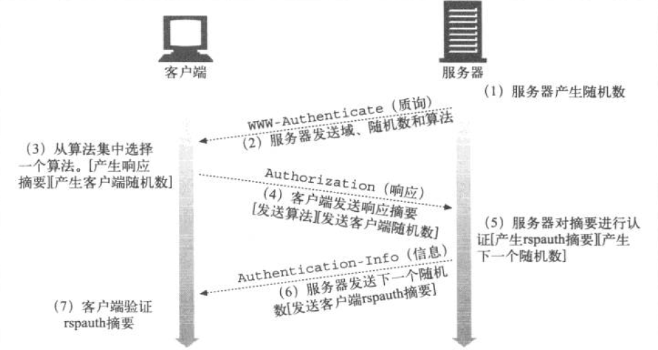

###摘要计算

*输入数据*

* 由单向散列函数H(d)和摘要KD(s,d)组成的一对函数，其中s表示密码，d表示数据
* 一个包含了安全信息的数据块，包括用户名、密码、保护域、随机数等，此部分只涉及安全信息，与底层报文无关，记为A1
* 一个包含了请求报文中非保密属性的数据块，包括URL、请求方法、报文实体部分，此部分有利于防止方法、资源等被篡改，记为A2

H和KD处理A1和A2产生摘要

*摘要认证会话*

客户端响应对保护控件的质询时，会启动一个以此保护空间的认证会话，在客户端收到来自另一个保护空间的质询之前这个会话一直持续。此时客户端应该记住与质询有关的隐晦值，以便在将来的请求时使用。

随机数过期时，即使Authentication中的随机数不再新鲜，服务器也可选择接受里面的内容或者发送401响应让客户端重试这条响应。

*预授权*

如果客户端事先知道下一个随机数是什么，就可以在服务器质询之前构建Authentication，生成正确的摘要，而不用进行完整的请求/质询循环了，这将大大减少报文的数量。一下是几种摘要认证的预授权的方式：

* 服务器预先在Authentication-Info成功首部中发送下一个随机数
* 服务器允许在一小段时间内使用同一个随机数
* 客户端和服务器使用同步的、可预测的随机数生成算法

###增强保护质量

目前采用在三种摘要首部提供qop字段：WWW-Authenticate、Authentication和Authentication-Info；通过这种方式，客户端和服务器端可以对不同类型及质量的保护进行协商。其过程如下：

* 服务器在WWW-Authenticate首部输出由逗号分隔的qop选项列表
* 客户端从服务器发送的qop选项列表中选择它支持且满足其需求的选项，放在Authentication的qop字段中回送给服务器

qop字段是可选的，有两种保护质量的初始值：表示认证的auth，带有报文完整性保护的认证auth-int

*摘要认证首部*

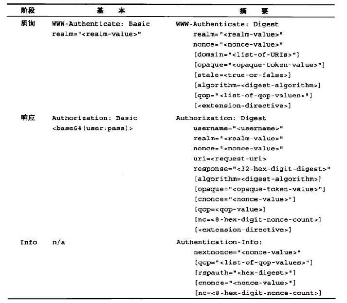

###其他问题

* 多重质询

	服务器可以对某个资源发起多重质询，客户端面对多重质询时，必须以它所支持的最强的质询机制来应答。质询自身可能会包含由逗号分隔的认证参数列表，如果WWW-Authenticate或Proxy-Authenticate首部包含多个质询，或提供了多个WWW-Authenticate首部，用户在解析时就要格外小心。同时管理员应提醒用户，即使运行了不同层次的安全措施，系统间使用相同密码也存在一定危险性。

* 差错处理

	当请求摘要不匹配时就记录一次登陆失败，如果连续几次登陆失败则可能是攻击者正在猜测密码。认证服务器要保证URI指令指定资源与请求行中指定的资源相同，否则返回400 Bad Request错误。
* 保护空间

	域值与被访问服务器的标准根URL结合形成了保护控件，通过域将服务器上的资源划分为一组保护空间，每个保护空间有自己的认证机制或授权数据库。域值是一个由原始服务器分配的字符串，可能会有多个授权方案相同但域不同的质询。保护空间确定了可以自动应用证书的区域。对保护空间的计算取决于认证机制：

	* 基本认证：客户端假定请求URI或旗下所有路径都与当前的质询处于同一保护空间内，因此可预先提交对此空间中资源的认证，无须等待来自服务器的下一条质询。
	* 摘要认证：有WWW-Authenticate：domain字段对保护空间作了更精确的定义，domain字段是一个用括号括起来的、中间由空格分隔的URI列表，通常次列表中的所有URI和逻辑上处于这些前缀的URI都位于同一个保护空间。如果没有domain字段，则质询服务器上的所有URI都在保护空间内。
* 重写URL

	代理可通过改变URI语法而不改变实际资源的方式重写URI：

	* 对主机名进行标准化，或用IP地址代替主机名
	* 用%转义取代嵌入的字符
	* 如果某类型的附加属性不会影响到获取资源，则可以将其附加或插入到URI

	代理可修改URI，而且摘要认证会检查URI的完整性，如果进行了任意一种修改，则认证就会被破坏
* 缓存

	共享的缓存在收到Authentication首部的请求时，只有当出现以下的某一种Cache-Control指令才应答：

	* Cache-Control的must-revalidate指令：缓存首先用新请求的请求首部与原始服务器进行验证，然后在继续应答时刻使用该响应的实体部分。
	* Cache-Control的public指令，对任意后续请求应答中都可以返回响应中的实体

###安全性考虑

* 首部篡改

	端到端加密或者对首部进行数字签名或两者结合。摘要认证的重点在于提供一种防篡改认证机制但并不一定将这种保护扩展到数据上去。  
* 重放攻击
	* 多重认证机制
	* 词典攻击
	* 恶意代理/中间人攻击
	* 选择明文攻击
	* 存储密码

## 第十四课：安全HTTP

HTTP安全技术提供的功能：

* 服务器认证
* 客户端认证
* 完整性
* 加密
* 效率
* 普适性
* 管理的可扩展性
* 适应性
* 在社会上的可行性

###HTTPS

使用HTTPS时，所有的HTTP请求和响应数据在发送之前都要进行加密，HTTPS在HTTP下面提供了一个传输级的密码安全层，可使用SSL或TSL。而大部分的编码和解码过程都在SSL库中进行，因此客户端和服务器端无须过多修改协议以处理逻辑，只需要使用SSL的输入/输出调用取代TCP的调用即可。

###数字加密

几个专用术语：

* 密码：对文本进行便面使得偷窥者无法识别的算法
* 密钥：改变密码行为的数字化参数
* 对称密钥加密系统: 编/解码使用相同密钥的算法
* 不对称密钥加密系统：编/解码使用不同密钥的算法
* 公开密钥加密系统
* 数字签名：用于验证报文未被伪造或篡改的校验和
* 数字证书：由一个可信的组织验证和签发的识别信息

密码的过程：

密码的发展过程：

手写密码——密码机——使用密钥的密码——数字密码

数字密码的加密解密过程：
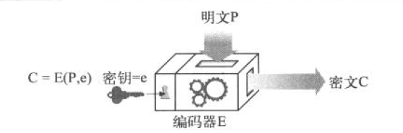

对称密钥加密技术：
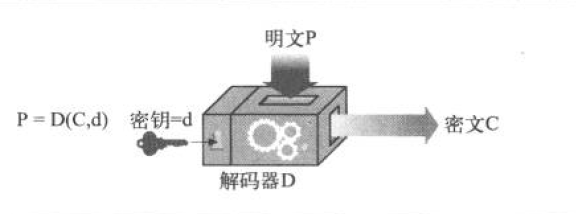

流行的对称密钥加密技术有：DES、Triple-DES、RC2、RC4

枚举攻击：使用暴力去尝试所有的密钥值。密钥的可能值取决于其位数和有效位。

公开密钥机密技术：
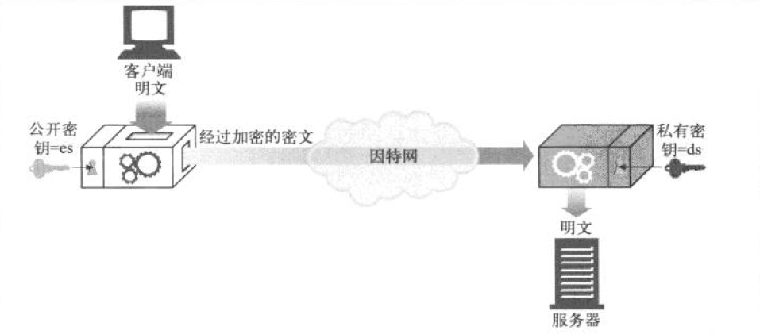

###数字签名

数字签名是附加在报文上的特殊加密校验码，使用数字签名的好处是：

* 可证明是作者编写了这条报文
* 可防止报文被篡改

数字签名通常是由非对称公开密钥技术产生的，只有所有者才知道其密钥，所以可以将作者的私有密钥当作“指纹”使用。

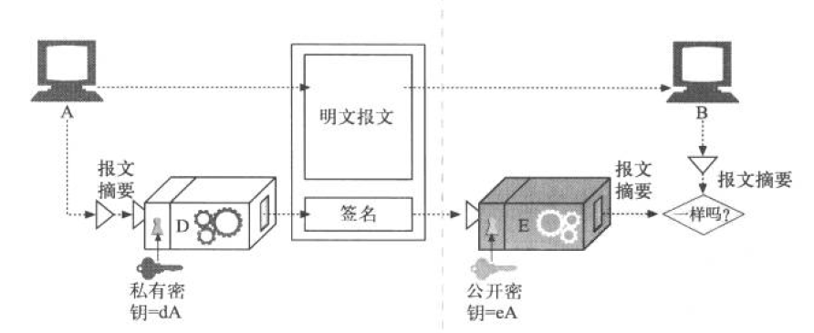
数字签名的过程：

1. 将报文提取为定长的摘要
2. 对摘要使用一个“签名”函数，以用户的私钥作为参数
3. 将签名附加在报文的末尾，发送
4. 接收端对签名进行检查，应用使用公钥的反函数，若结果不匹配则可能内容被篡改或者发送对象不对

###数字证书

证书的主要内容：

* 对象的名称
* 过期时间
* 证书发布者
* 来自证书发布者的数字签名
* 公开密钥、签名算法描述
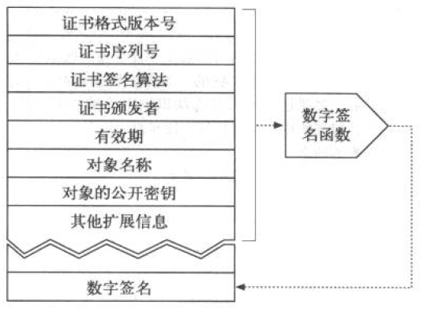

服务器证书：

* web站点的名称和主机名
* web站点的公开密钥
* 签名颁发机构的名称
* 来自签名颁发机构的签名

验证过程：
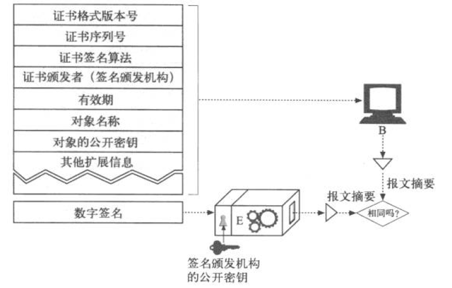

###HTTPS细节介绍

通常，非安全HTTP的URL方案前缀为http，而安全HTTPS协议的URL方案前缀为https；当一个客户端请求发生时，会先检查URL方案：

* 如果URL方案为http，客户端则打开一条到服务器端口80的连接并发送老的HTTP命令
* 如果URL方案为https，客户端则打开一条到服务器端口443的连接，然后与服务器握手，以二进制格式与服务器交换一些SSL安全参数，附上加密的HTTP命令

SSL是二进制协议，其流量承载在另外的端口。

**SSL握手**

在发送加密的HTTP报文之前，客户端和服务器端要进行一次SSL握手：

* 交换协议版本号
* 选择一个两端都了解的密码
* 对两端的身份进行认证
* 生成临时的会话密钥，以便加密信道
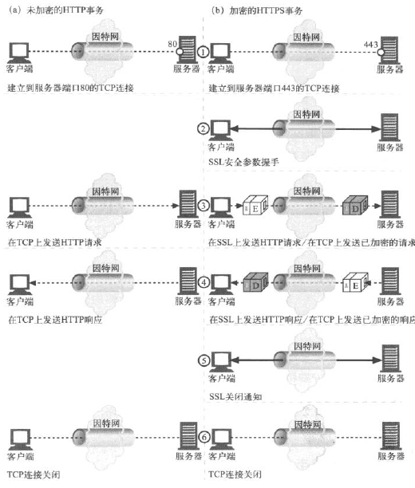

**服务器证书**

SSL支持双向认证，将服务器认证承载回客户端，将客户端认证回送给服务器。服务器证书是一个显示了组织名称、地址、服务器DNS域名以及其他信息的派生证书。

证书有效性验证：

* 日期检测：检测证书的起始日期和结束日期，或证书是否激活
* 签名颁发者可信度检测
* 签名检测
* 站点身份检测

----

## 第十五课：实体和编码

HTTP所传输的各类媒体对象要保证：

* 可以被正确地识别（通过Content-Type首部说明媒体格式，通过Content-language首部说明语言）以便浏览器和其它客户端可以正确处理内容
* 可以被正确地解包（通过Content-length和Content-Encoding首部）
* 是最新的（通过实体验证码和缓存过期控制）
* 符合用户的需要（通过Accept系列的内容协商首部）
* 在网络上可以快速有效地传输（通过快速请求、差异编码以及其他数据压缩方法）
* 完整达到、未被篡改（通过传输编码首部和Content-MD5校验和首部）

HTTP报文作为因特网中运送货物的箱子，而实体则是箱子里的货物。

实体分为实体首部和实体主体两个部分，两个部分用一个空行隔开；以下是十个基本的实体首部：

* Content-Type：实体对象的类型
* Content-Length：实体主体的大小或长度
* Content-Language：传送对象最相匹配的人类语言
* Content-Encoding：数据对象所做的任意变换
* Content-Location：备用位置，请求时可通过它获取对象
* Content-Range：说明这部分实体属于整体的哪个部分
* Content-MD5：实体主体的校验和
* Last-Modified：所传输内容在服务器上创建或最后修改的时间
* Expires：数据将要失效的时间
* Allow：该资源允许的请求方法
* ETag：这份文档特定实例的唯一验证码
* Cache-Control：指出应该如何缓存该文档

###Content-Length

此首部说明的是报文中实体主体的字节大小，是包含了所有编码的（非原始长度，而是做过处理之后的编码长度）；除非使用了分块编码，否则带有实体的报文都必须有次首部。

作用：

* 检测截尾

	使用Content-Length确定报文的结束，并关闭连接。在使用持久连接的时候，客户端无法通过连接关闭来判定报文结束，则Content-Length成为唯一的方式知道报文从哪里结束，下一条报文从哪里开始。

当主体内容进行了重新编码或者压缩后，Content-Length指定的应该是内容编码或压缩之后的长度。

确定Content-Length的规则：

1. 如果特定的HTTP报文中不允许带有主体（如HEAD请求、204、304响应），则直接忽略Content-Length首部，它是对没有实际发出的主题进行计算的并不说明实际的主题长度
2. 如果报文中含有Transfer-Encoding首部，则实体是以一个“零字节块”的特殊模式结束，除非报文已经因连接关闭而结束。
3. 如果报文中含有Content-Length首部（并报文允许有实体），而且没有Transfer-Encoding首部，那么此值就是主体的长度。
4. 如果报文使用了multipart/byteranges（多部分/字节范围）媒体类型，并且没有Content-Length首部，则多部分中的每个部分都需要说明自己的大小
5. 如果以上规则都不匹配，尸体就在连接关闭时结束

以上五条规则按顺序进行匹配，先匹配的则适用。

###Content-MD5

检测主体部分是否被修改：Content-MD5首部

服务器使用Content-MD5首部发送对实体主体部分运行MD5算法的结果，只有原始服务器能计算并发送此首部，中间代理和缓存不应该修改或添加此首部。Content-MD5首部是在对内容做了所需要的内容编码之后尚未做任何传输编码之前计算的，为验证报文完整性，客户端应该先进行传输编码的解码，在计算为进行传输编码的MD5值。

###Content-Type

Content-Type说明主体的MIME类型，MIME类型由 主媒体类型/子类型 构成。常用类型如下：
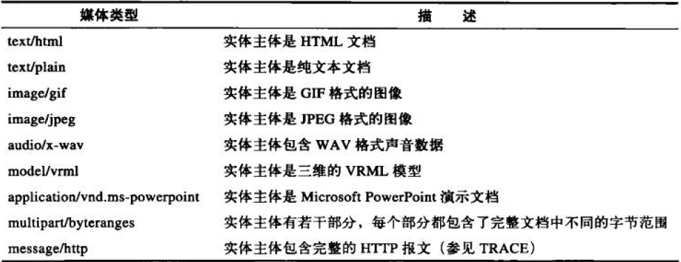
注意此首部说明的是实体主体未经任何编码之前的媒体类型。同时，此首部还支持charset参数用来说明字符编码的方式。

多部分媒体类型：

multipart*的报文中包含多个报文，它们合在一起作为单一的复杂报文发送，但每一部分都是独立的，有各自描述其内容的集；不同部分之间用分界字符串连接在一起。HTTP中支持的多部分有两种：提交填写的表格、作为承载若干文档片段的范围响应

Content-type有multipart/form-data或者multipart/mixed来发送这种多部分请求。

###内容编码

过程：

* 网站服务器生成原始报文（其中包含原始的Content-Type和Content-Length）
* 内容编码服务器创建编码后的报文（此报文的Content-Type和Content-Length可能会发生变化），添加Content-Encoding首部
* 接收程序得到编码后的报文，进行解码，得到原始报文
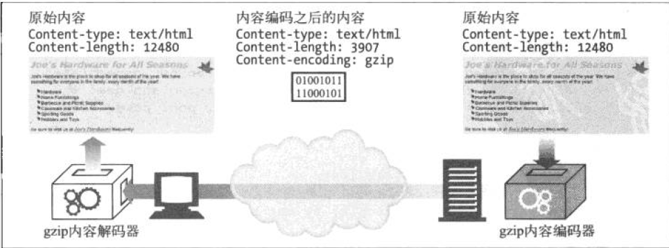

常用编码类型：
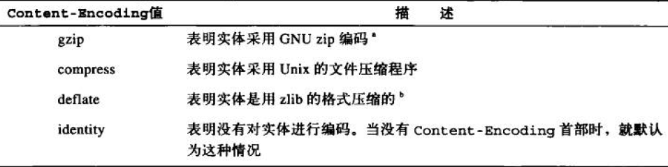

**Accept-Encoding首部**

客户端通过此首部将自己能够支持的内容编码方式列表发送给服务器端，以防止服务器端以其无法解码的方式编码。

###传输编码与分块编码

内容编码是对报文主体进行的可逆变换，与内容的具体格式紧密相关；而传输编码也是对报文的可逆变换，但与内容格式无关，而是与架构相关。使用传输编码是为了改变报文数据在网络中的传输方式。

**Transfer-Encoding首部**

Transfer-Encoding首部告知接收方为了可靠地传输报文，已经对其进行了何种编码。   
TE首部用在请求首部中，告知服务器可以用那种传输编码扩展

**分块编码**

分块编码是传输编码的一种，它将报文分割为若干个大小已知的块，块之间紧挨着发送。因为是传输编码，所以它是报文属性的。

传输编码规则：

* 传输编码集合中必须包含分块
* 使用分块编码时，它必须是最后一个作用到报文上的
* 分块传输编码不能多次作用到同一个报文上

## 第十六课：国际化

## 第十七课：内容协商与转码

## 第十八课：web主机托管

## 第十九课：发布系统

## 第二十课：重定向与负载均衡

## 第二十一课：日志记录