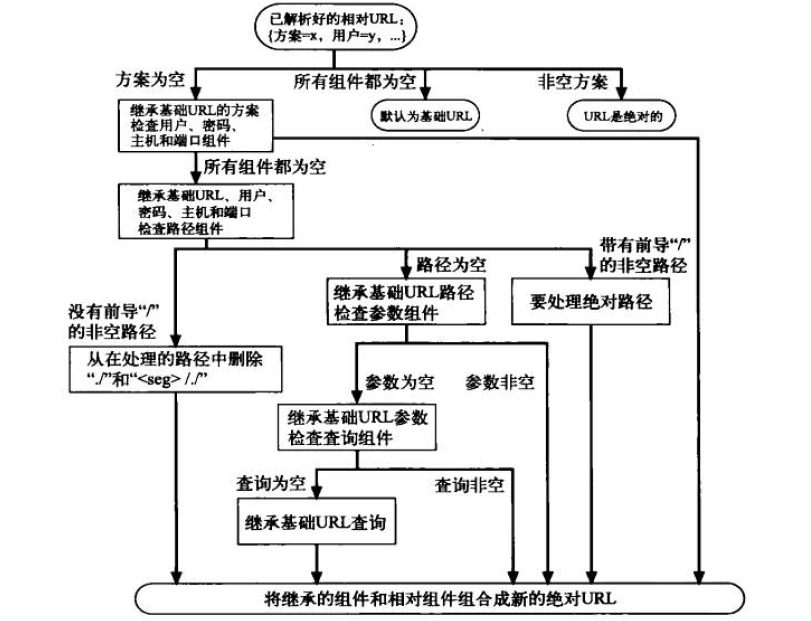
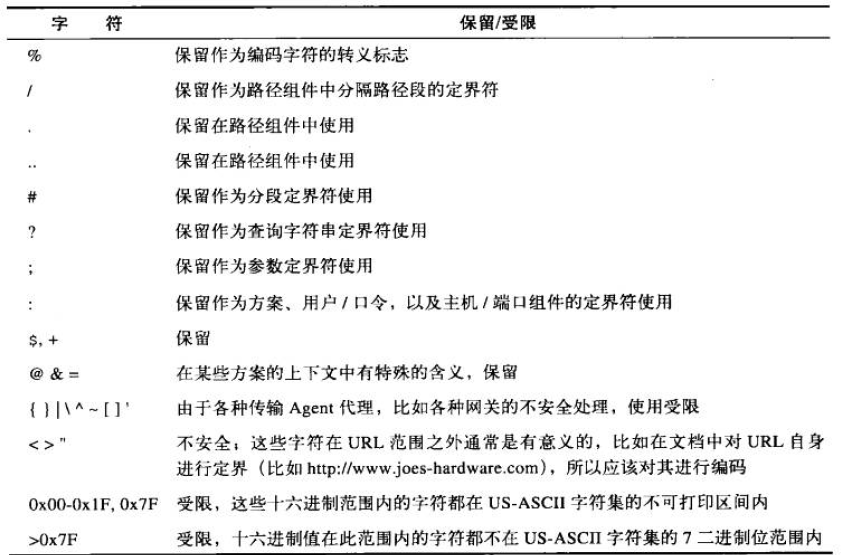
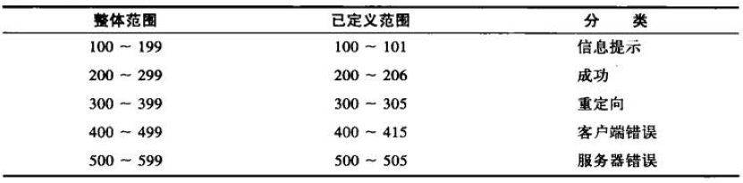

## 第一课：Quick Start

访问网站的过程，HTTP都做了什么？    

- 输入网址（web客户端发送HTTP请求报文，在地址栏输入的内容叫做URI，通常情况下都使用的是URL这种类型的地址，地址的内容包括了协议名称、web服务器名称、资源地址）
- 等待网站响应（通常情况下这个过程是比较短暂的，但web服务器却做的不少）
	- web服务器接收到请求以后，通过URL地址照到对应的资源，然后发送HTTP响应报文，响应的内容有：响应状态码、资源类型（MIME）、资源长度、资源内容。。。
	- web客户端接收响应信息，根据其中的资源类型对资源进行解析，并按照其格式显示为网页或其他资源类型
	
整个过程中，涉及到的知识：URL、HTTP状态码、MIME格式

一个单独的网页，通常情况下会有多个HTTP请求，包括HTML页面请求、页面的内嵌资源：如js、css文件、图片文件、视频音频文件等等    

HTTP报文只有两种：请求报文、响应报文；两种报文都是由简单的字符串组成，分为以下三个部分：

- 起始行（即报文的第一行）
	- 对于请求报文，起始行用于说明要做什么（HTTP方法、请求内容）
	- 对于响应报文，起始行用于说明出现了什么情况（响应状态码）
- 首部字段（起始行后面跟着的0个或多个名值对，用冒号分隔；首部以一个空行结束）
- 主体
	- 请求报文：要发送给服务器的数据（对于get请求就没有此内容）
	- 响应报文：返回给客户端的数据（可以是任何类型的文件，如HTML、Txt）

HTTP报文的转送——TCP/IP协议，HTTP协议建立在TCP协议之上，也就是说，在发送HTTP报文之前，web客户端与web服务器之间会通过URL建立一条TCP连接，建立的过程运用到DNS域名服务器解析。

使用Telnet命令建立TCP链接并测试HTTP请求的响应内容，模拟HTTP客户端。

web应用程序（除web浏览器、web服务器之外的）

- 代理（位于客户端和服务器之间，接收所有客户端的HTTP请求并转发给服务器，也就是代表客户端与服务器进行通信，代理可对请求和响应进行过滤）
- 缓存（将经过代理请求的文档复制保存起来，下一次访问时可直接访问副本）
- 网关（可将HTTP流量转换为其他协议）
- 隧道（对原始信息进行盲转发，通常用于加密）
- Agent代理（代表用户发起HTTP协议的应用程序，比如web浏览器、网络爬虫就是一种Agent代理）

## 第二课：URL

URL作为URI的一个子集，它主要通过资源的位置来进行标识资源；URI的另一个比较主要的子集URN则是通过名字来进行识别。

URL可分为三个部分：

- URL方案：此部分告知web客户端怎样访问资源，即使用什么协议，对于HTTP访问则是HTTP协议
- 服务器位置：此部分告知web客户端资源位于何处，可以是服务器域名也可以是IP地址
- 资源路径：此部分告知web客户端资源所在服务器本地的具体路径

具体来说：方案+主机+路径    
同时URL也可以通过其他的协议来访问资源。

URL语法:

<pre>
	方案://用户名:密码@主机:端口/路径;参数?查询字符串#页面片段
</pre>

对于HTTP协议，常用的是“主机:端口”、“路径:参数”、“查询字符串”、“页面片段”

URL的快捷方式：相对URL（在资源内部使用），关于如何在绝对URL和相对URL之间进行切换，需要涉及到基础URL，基础URL的位置有两种提供方式：
	
- 资源中显示提供：通过<base>标签指定页面中所有相对URL的基础URL
- 封装资源的基础URL：当没有显示指定时，一般将该资源的所属资源的URL作为基础URL
- 无基础URL：此时则会出现问题，该URL无效

相对URL的解析过程可用如下的流程图解释：

自动扩展URL功能：

- 主机名扩展
- 历史扩展

URL编码机制：ASCII码+转义字符，转义字符用来表示不安全字符，同时有一些被保留受限的一些字符：

## 第三课：HTTP报文

请求报文的语法格式：

	<方法> <请求URL> <版本>
	<首部信息>
	<主体信息>

响应报文的语法格式：

	<版本> <状态码> <原因短语>
	<首部>
	<主体>

常用的**HTTP方法**：

- GET：从服务器获取资源
- POST：向服务器发送数据
- PUT：将主体信息储存在服务器
- DELETE：从服务器删除资源
- OPTIONS：决定可以在服务器执行哪些方法
- HEAD：只从服务器获取文档的首部
- Trace：追踪

并不是所有的浏览器都实现了衣裳的几种方法。在这些方法中，GET和HEAD方法被视为安全方法，即不会在HTTP服务器产生什么影响，GET和HEAD的区别就在于，HEAD请求的响应只返回首部的内容，而不返回主体。

使用HEAD请求的作用有：

- 在不获取资源的情况下查看资源的相关信息
- 通过查看响应码判定资源是否存在
- 通过查看首部测试资源是否被修改

除这些HTTP方法外，HTTP还支持扩展方法，可以自己编写HTTP扩展方法实现一些现有HTTP标准方法所不能实现的功能，如MOVE方法可以移动服务器资源

HTTP**响应状态码**：

最常见的两种状态码：200（成功）、404（NOT FOUND）

100 continue状态码用于当客户端想要向服务器端发送大容量的主体时才使用，且只有HTTP1.1版本才支持此状态

300重定向状态码，通过响应报文的location首部可告知资源的新位置

400范围为客户端错误状态码，500范围为服务器端错误状态码

**HTTP首部**字段：向请求信息或响应信息添加一些附加说明的内容，一般以名值对的形式出现，首部可分为通用首部（请求报文和响应报文都有的，如DATE）、请求首部、响应首部、实体首部、扩展首部，

常用的首部有：Date、Content-length、Content-type（用于描述实体内容，为实体首部）、Accept（客户端希望接受什么类型的资源，请求首部）

请求首部分为：Accept首部、条件请求首部、安全请求首部、代理请求首部    
响应请求首部：协商首部、安全响应首部    
实体首部：内容首部（content系列）、实体缓存首部

## 第四课：连接管理