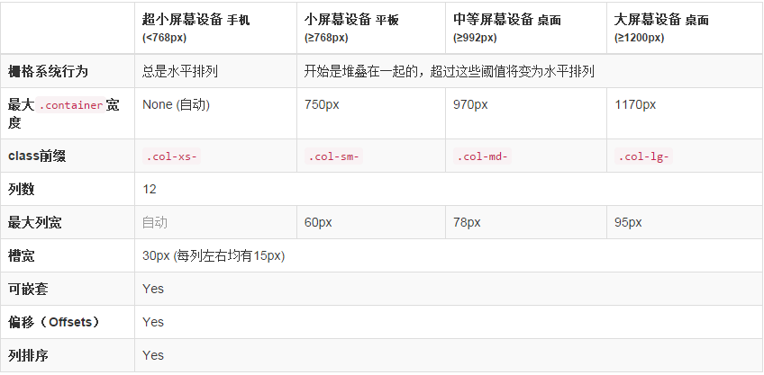

# BootStrap@CSS

## 栅格系统

BootStrap内置的一套响应式、移动设备优先的流式栅格系统，通过一系列行和列的组合创建布局，其工作原理如下：

* 行必须包含在 .container 中，以便为其赋予合适的排列（aligment）和内补（padding）
* 使用行在水平方向创建一组列，内容应当放置于列中，且只有列可以作为行的直接子元素
* 类似 .row 和 .col-xs-4 这些预定义的栅格类，可以快速创建栅格布局，Bootstrap源码定义的minin也可以用来创建语义化布局
* 通过设置padding设置列之间的间隔，通过为第一个和最后一个设置负值的margin抵消padding的影响
* 栅格系统中的列是通过指定1-12的值来表示其跨越的范围，如3个等宽的列可用 .col-xs-4 来创建

### 媒体查询

在栅格系统中通过如下媒体查询创建关键分界点域值：

	@media (min-width: @screen-sm-min) {...}
	@media (min-width: @screen-md-min) {...}
	@media (min-width: @screen-lg-min) {...}

### 栅格选项

## 排版

Bootstrap提供.h1-.h6的行内标题样式类，通过添加.lead类可突出显示段落，小号文本提供.small类，通过添加text-left/center/right类可设置文本对齐方式，通过添加.list-unstyled可创建无样式列表，添加.list-inline可使得列表成为行内元素。

## 表格

.table-striped为表格添加斑马条纹
.table-bordered为表格添加边框
.table-hover为表格添加鼠标悬停事件响应

## 表单

单独的表单控件会被自动赋予一些全局样式。所有设置了.form-control的 input、textarea 和 select 元素都将被默认设置为width: 100%;。将label和前面提到的这些控件包裹在.form-group中可以获得最好的排列。

### 内联表单

为form元素.form-inline可使其内容左对齐并且表现为inline-block级别的控件。只适用于浏览器窗口至少在 768px 宽度时（窗口宽度再小的话就会使表单折叠）。需要设置宽度：在Bootstrap中，input、select和textarea默认被设置为100%宽度。为了使用内联表单，你需要专门为使用到的表单控件设置宽度。一定要设置label：如果你没有为每个输入控件设置label，屏幕阅读器将无法正确识读。对于这些内联表单，你可以通过为label设置.sr-only已将其隐藏。

### 水平排列的表单

通过为表单添加.form-horizontal，并使用Bootstrap预置的栅格class可以将label和控件组水平并排布局。这样做将改变.form-group的行为，使其表现为栅格系统中的行（row），因此就无需再使用.row了。

### 被支持的控件

Input：text、password、datetime、datetime-local、date、month、time、week、number、email、url、search、tel和color
Textarea：可根据需要改变row属性
Checkbox和Radio：
	Inline checkboxes

	通过将.checkbox-inline 或 .radio-inline应用到一系列的checkbox或radio控件上，可以使这些控件排列在一行。
Select：使用默认选项或添加multiple属性可以显示多个选项

### 静态控件

在水平布局的表单中，如果需要将一行纯文本放置于label的同一行，为
元素添加.form-control-static即可。

### 控件状态

为输入框设置disabled属性可以防止用户输入，并能改变一点外观，使其更直观。   
为fieldset设置disabled属性可以禁用fieldset中包含的所有控件。    
a标签的链接功能不受影响，这个class只改变class="btn btn-default" 按钮的外观，并不能禁用其功能。建议自己通过JavaScript代码禁用链接功能。   
跨浏览器兼容性：虽然Bootstrap会将这些样式应用到所有浏览器上，Internet Explorer 9及以下浏览器中的<fieldset>并不支持disabled属性。因此建议在这些浏览器上通过JavaScript代码来禁用fieldset   
Bootstrap对表单控件的校验状态，如error、warning和success状态，都定义了样式。使用时，添加.has-warning、.has-error或.has-success到这些控件的父元素即可。任何包含在此元素之内的.control-label、.form-control和.help-block都将接受这些校验状态的样式。