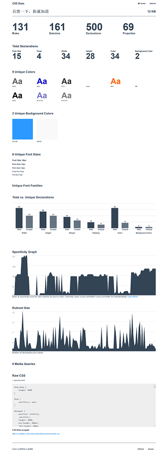

## CSS统计

CSS分析网站：**[cssstats.com](cssstats.com)**

如何使用这些数据：

* Focus on Maintainability(可维护性)：CSS的可维护性基于以下几点
		
	* 是否能够简单地设计一个独立的模块
	* 能否简单地设计模块的版本
	* 其他开发人员能否理解你的CSS
	* 你的CSS是否可预知、具有一致性、有组织性
	* 你是否使用预处理器使得开发和分离变得更加灵活
	* 你是否经常重用你的代码
	* 你是否使用预先定义的名称

* 如何分析CSS数据
	* CSS bloat：无用的、多余的，不必要的CSS

