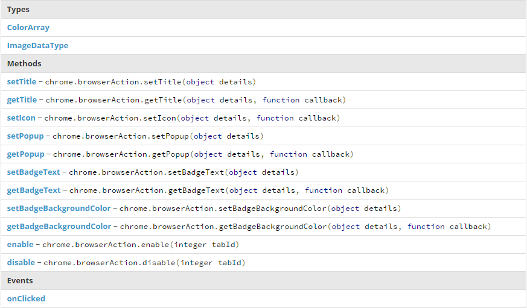
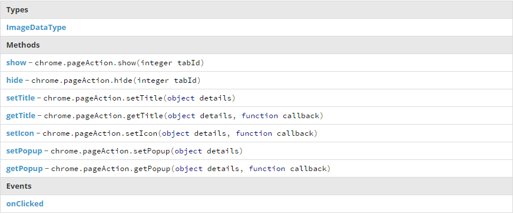

# OverView

**插件的本质:** 一系列打包压缩的文件，这些文件包括HTML、CSS、JavaScript、images文件或者别的什么，这一系列文件都是用来为Chrome浏览器扩展功能的。而插件本质上就是一些网页，这些网页可以使用chrome提供的各种API工具，可以通过content script或者cross-origin XMLHttpRequests访问或操作网页和浏览器，比如说书签和网页选项卡。

每个插件都可以以*浏览器动作（browser action）*或者*页面动作（page action）*的形式插入图标，其中浏览器动作的图标是插入在地址栏外部的，而页面动作的图标是插入在地址栏内部的右侧的。一个插件至多有一个浏览器动作或者一个页面动作，当需要处理多个页面时选择浏览器动作，当只需要处理一个页面时选择页面动作。此外，插件还可以通过右键菜单、单独页面、改变网页外观等形式插入图标提供功能。

详细地说明，一个插件包中应该***至少***包含下列文件：

* 一个manifest文件，用于插件的定义，以及各类引用的定义
* 一个或多个HTML文件(除非此插件是一个主题)

另外***可选***的有下列文件：

* 一个或多个JS文件
* 任何其他你的插件需要用到的文件，如css文件、image文件等

**在chrome插件中引用文件**：

* 可以使用相对URL引用，这与平时的用法一样
* 插件中的所有文件都有一个绝对的地址：*chrome-extension://< extentionID >/< pathToFile >*，这其中的*extensionID*是每个插件都会有的一个识别ID，由chrome分配，而pathToFile是该文件相对于插件根目录的地址。在插件正式打包之前，extensionID是可变的，此时可以通过 @@extension_id 引用。而插件一旦打包发布之后，它的ID就不会变了，即使进行了更新，ID也不会变化，此时就可以将@@extension_id都替换为真正的ID 

**Manifest文件**：

这是一个*json*文件，命名为manifest.json，提供一些与插件有关的信息，以及插件需要使用的权限等等，一下是一个典型的manifest文件：

	{
  		"name": "My Extension",
  		"version": "2.1",
  		"description": "Gets information from Google.",
  		"icons": { "128": "icon_128.png" },
  		"background": {
  		  "persistent": false,
  		  "scripts": ["bg.js"]
  		},
  		"permissions": ["http://*.google.com/", "https://*.google.com/"],
  		"browser_action": {
  		  "default_title": "",
  		  "default_icon": "icon_19.png",
  		  "default_popup": "popup.html"
  		}
	}

**插件的结构**：

background page，这是一个不可见的但支撑整个插件的逻辑的文件，一个插件同时还可以有些其他的提供插件功能的页面（UI pages），如果插件需要与网页进行交互操作，则需要用到content script。

*background page*：
	
背景页有两种：第一种永久的背景页，一种是事件背景页；前一种一直开启，后一种则只在需要时开启，如果不需要长时间保持背景页处于运行状态，则最好选择后一种背景页。

*UI pages*：

UI页面可以是简单的HTML页面，比如popup弹出页面就是一个平常的HTML文件；也可以是供用户选择功能的option页面；也可以是override页面。

插件中的页面之间可以互相访问对方的DOM也可以插入方法等等。

**Content Script**：

content script是插入web页面的js代码，可对web页面进行操作，插件能够实现与页面之间的交互就是通过content script这个帮手。可以将content script看作是web页面的一部分，而不是打包的插件的一部分，通过content script可以读取页面信息并对页面进行各种操作，但却不能对background page进行这类操作。

但content script并不是与其父级插件完全隔离开的，content script可以与父级插件进行信息交流，通过sendMessage

**chrome. * APIs**

开发过程中可以使用chrome提供的专有API，大多数的chrome API提供的方法都是异步的，一般采用回调函数的方式对执行结果进行处理，而不会直接返回结果。其他一些同步的方法一般会有一个返回值，但没有回调函数，比如getURL。

在使用这两种不同的方法之前一定要分辨清楚，以免出错。

**页面间的交流**

插件内部的页面间通常需要进行交流，这些页面可以直接访问对方的函数方法，也可通过getView和getBackgroundpage方法来获取页面

**数据存储**

插件可以通过chrome的storage API使用HTML5的web storage API进行数据的存储。

**匿名模式**

对于匿名模式的网页信息不要保存用户的浏览记录，在chrome中可以通过tab.incognito来判断该网页是否是匿名模型的网页

# Browser Action

Browser Action将插件图标放置在浏览器工具栏的地址栏（外部）右侧，可拥有icon、tooltip、badge和popup；在manifest文件中的对应配置内容是这样的：

	{
        "name": "My extension",
        ...
        "browser_action": {
          "default_icon": {                    // optional，定义图标
            "19": "images/icon19.png",           // optional，19X19大小的图标
            "38": "images/icon38.png"            // optional，38X38大小的图标
			//有时还会加上128X128大小的
          },
          "default_title": "Google Mail",      // optional; 鼠标浮到图标上的提示
          "default_popup": "popup.html"        // optional，点击图标的弹出页面
        },
        ...
     }
如果只传入了一种大小的图标（即不分19或38），则浏览器会根据用户的屏幕对图标进行变形，使其适应用户的屏幕，这样容易使图标损失像素导致不清晰。

**icon**

图标的理想大小为19X19像素，可以是引入的图片也可以是HTML canvas元素，直接引入图片更加简单便利，但使用canvas就可以创建动态的图标了。通过manifest文件中的browser_action的default_icon对图标进行定义，或者可以通过调用browserAction.setIcon方法进行定义。icon的定义可以是多个不同大小的图片，以适应不同的电脑屏幕。

**Tooltip**

使用manifest文件中browser_action的default_title字段或者调用browserAction.setTitle方法进行定义。

**Badge**

Badge是浮在图标上的一些文字，通过browserAciton.setBadgeText和browserAction.setBadgeBackgroundColor可以设置Badge的内容和背景色。

**popup**

popup就是一个在用户点击图标的时候弹出的HTML页面，使用manifest文件中browser_action的default_popup或者调用browserAction.setPopup方法进行设置。

###使用BrowserAction的一些建议

* 对作用于大多数网页的事务使用browseraction，对作用于少数页面的事务使用pageaction
* browseraction的图标相对与pageaction的图标要更大更鲜艳一些
* 不要使用chrome的单色图标，应该更突出一些
* 使用透明度以增加图片的层次感，使得图标在多种多样的背景色上也十分好看
* 不要让你的图标一直是动态，那非常烦人

###总结

# Page Action

chrome.pageAction将图标放置在浏览器地址栏（内部）右侧，page action作用于当前页面但不作用于所有的页面，其manifest文件中相应的设置为：

	{
        "name": "My extension",
        ...
        "page_action": {
          "default_icon": {                    // optional
            "19": "images/icon19.png",           // optional
            "38": "images/icon38.png"            // optional
          },
          "default_title": "Google Mail",      // optional; shown in tooltip
          "default_popup": "popup.html"        // optional
        },
        ...
      }
相对于browser action来说，page action的区别在于page action没有badge，同时page action的图标的显示隐藏是可控的，通过调用pageAction.show和pageAction.hide方法即可。同时当一个页面显示了page action，直到关闭该页面或页面导向新的URL时图标都不会消失。

###总结

# Manifest file

每一个插件或chrome应用都有一个JSON格式的manifest文件，名为manifest.json，用于一些重要信息的说明。manifest文件中可填写的字节有许多，但必须的只有两个——name和version，用以说明插件的名字和版本。

	{
  		// Required
 		 "manifest_version": 2,
 		 "name": "My Extension",
 		 "version": "versionString",

 		 // Recommended
 		 "default_locale": "en",
 		 "description": "A plain text description",
 		 "icons": {...},//图标
		
		 //Pick one (or none)
		  "browser_action": {...},
		  "page_action": {...},

		  // Optional
		  "author": ...,
		  "automation": ...,
		  "background": {
	   		 // Recommended
	    	"persistent": false
	 		},
		  "background_page": ...,
		  "chrome_settings_overrides": {...},
		  "chrome_ui_overrides": {
		    	"bookmarks_ui": {
		     		 "remove_bookmark_shortcut": true,
		     		 "remove_button": true
			   	}
		  },
		  "chrome_url_overrides": {...},
		  "commands": {...},
		  "content_pack": ...,
		  "content_scripts": [{...}],
		  "content_security_policy": "policyString",
		  "converted_from_user_script": ...,
		  "current_locale": ...,
		  "devtools_page": "devtools.html",
		  "externally_connectable": {
		    	"matches": ["*://*.example.com/*"]
		  },
		  "file_browser_handlers": [...],
		  "homepage_url": "http://path/to/homepage",
		  "import": ...,
		  "incognito": "spanning or split",
		  "input_components": ...,
		  "key": "publicKey",
		  "minimum_chrome_version": "versionString",
		  "nacl_modules": [...],
		  "oauth2": ...,
		  "offline_enabled": true,
		  "omnibox": {
			    "keyword": "aString"
		  },
		  "optional_permissions": ["tabs"],
		  "options_page": "options.html",
		  "options_ui": {
		    	"chrome_style": true,
		    	"page": "options.html"
		  },
		  "permissions": ["tabs"],
		  "platforms": ...,
		  "plugins": [...],
		  "requirements": {...},
		  "sandbox": [...],
		  "script_badge": ...,
		  "short_name": "Short Name",
		  "signature": ...,
		  "spellcheck": ...,
		  "storage": {
		    	"managed_schema": "schema.json"
		  },
		  "system_indicator": ...,
		  "tts_engine": {...},
		  "update_url": "http://path/to/updateInfo.xml",
		  "web_accessible_resources": [...]
		}

# Background Page

background page是一个运行在插件进程中的HTML页面，在插件的整个生命期中，只有一个background page在运行，知道插件生命期结束为止。通常情况下，background page是不需要任何HTML元素标记的，所以通常background page只包含一个js文件，在manifest中的配置如下：

	{
  		"name": "My extension",
  			...
  		"background": {
    		"scripts": ["background.js"]，
			"page": "background.html"
  		},
  			...
	}
也可以通过page字段来设置background的页面文件，如果没有设置page字段则插件系统会自动渲染background页面并引入scripts中指定的js文件。

页面之间可以直接通过调用方法进行交流，其用法和框架之间的交流是一样的。extension.getViews方法返回插件中的运行页面对象的列表。extension.getBackgroundPage方法返回背景页对象。

# Content Scripts

content script是运行在网页上下文中的js文件，通过DOM可以读取网页的详细信息或者对网页元素进行操作。但content script并不是万能的，它具有以下限制：

* 不能使用的chrome API
	* extension(getURL ,inIncognitoContext ,lastError ,onRequest ,sendRequest )
	* i18n
	* runtime(connect ,getManifest ,getURL ,id ,onConnect ,onMessage , sendMessage)
	* storage
* 不能访问由插件页面定义的变量和方法
* 不能访问有网页或其他content script定义的变量和方法

以上问题都可以通过交换信息来解决，还可以使用cross-site XMLHttpRequest，也可以通过共享的DOM结果与web page取得联系。如果你的content script总是需要被引入，就应当将其写入manifest文件中：

	{
 		 "name": "My extension",
 		 ...
 		 "content_scripts": [
  		  {
    		  "matches": ["http://www.google.com/*"],
    		  "css": ["mystyles.css"],
    		  "js": ["jquery.js", "myscript.js"]
    		}
  		],
  		...
	}
如果你的content script只在需要时被引入，则写入permission字段中：

	{
  		"name": "My extension",
  		...
  		"permissions": [
  		  "tabs", "http://www.google.com/*"
  		],
  		...
	}
content_scripts字段是一个对象数组，每一个对象都可以包含下列属性：

* matches——此字段是必须的，字符串数组，用于说明那些页面需要插入次对象指定的content script，通常情况下为*，表示所有的页面，也可以使用正则表达式进行匹配。
* exclude_matches——此字段可选，字符串数组，用于说明那些页面不需要插入此对象指定的content script
* match_about_blank——此字段可选，布尔值，用于说明是否向空白页面插入此对象指定的content script
* css——可选，字符串数组，要插入的css文件列表
* js——可选，字符串数组，要插入的js文件列表
* run_at——可选，字符串，用于控制js文件插入的时间
	* document_start
	* document_end
	* document_idle(默认)
* all_frames——可选，布尔值，用于控制content script是否在所有的框架中运行（否则只在top框架中运行）
* include_globs——可选，字符串数组，
* exclude_globs——可选，字符串数组

当一个页面的URL与matches或者 include_ globs 的表达式匹配，或者与exclude_ matches、exclude_globs不匹配，则该网页就会被植入content script。其中matches用来圈定插入content script的大范围，而其他三个字段用于限制一些小的条件。

要向网页插入js、css等代码，需要获取cross-origin权限，同时还需要获取chrome.tabs
的权限。通过tabs.executeScript和tabs.insertCSS向网页插入js或者css文件。

content script运行在一个特殊的隔离环境，它可以访问所插入网页的DOM结构，却不可以访问该网页的js变量或方法，与此同时，网页也不可以访问content script的变量或方法。这样的设置使得content script与web网页之间不会发生冲突。

虽然content script与其被插入的网页之间的运行环境是相互隔离的，但他们共享一个DOM结构，如果content script想要与网页进行沟通，则必须通过DOM，使用postMessage方法发送信息，对message事件进行监听，这两者即可进行交流了。如下：

	contentscript：
		var port = chrome.runtime.connect();

		window.addEventListener("message", function(event) {
		  // We only accept messages from ourselves
			  if (event.source != window)
		    return;

		  if (event.data.type && (event.data.type == "FROM_PAGE")) {
			    console.log("Content script received: " + event.data.text);
			    port.postMessage(event.data.text);
		  }
		}, false);

	web page：
		document.getElementById("theButton").addEventListener("click",
   		 function() {
  			window.postMessage({ type: "FROM_PAGE", text: "Hello from the webpage!" }, "*");
		}, false);

安全问题：

* 第一点：
* 第二点：

插件文件的引用：使用chrome.extension.getURL("")即可获取文件地址，使用是和其他的URL使用方法一样。

## Match Patterns

此部分用于说明content scripts配置的matches字段。 

match patterns是一个可能包含有* 符号的URL，比较特殊的all-urls表示匹配所有的URL，一般用*表示。

使用语法：

	< url-pattern> := < scheme>://< host>< path>
	< scheme> := '*' | 'http' | 'https' | 'file' | 'ftp'
	< host> := '*' | '*.' <any char except '/' and '*'>+
	< path> := '/' <any chars>
*在不同的位置表示不同的含义，比如说在协议部分表示一切协议，而在主机名部分表示任何主机名，或者某个部分匹配任意的字符串，在路径部分也一样。

# Permission

如果要使用chrome提供的大部分API，就必须在配置文件manifest中的permission字段声明。permission字段是一个字符串列表，这些字符串是预先定义好的，或者是match patternz匹配的URL网页。

权限列表： [https://developer.chrome.com/extensions/declare_permissions](https://developer.chrome.com/extensions/declare_permissions)

-------------------------------------------------------------

