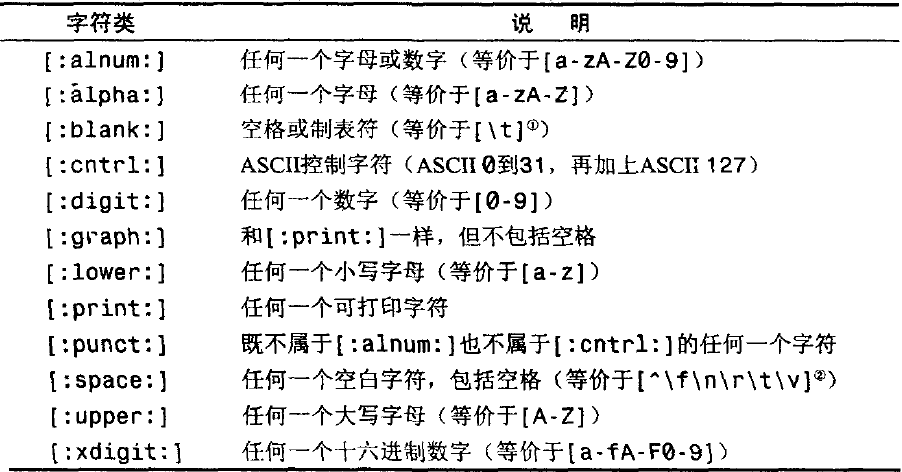

## 第一课

正则表达式的两种基本用途：搜索和替换

### 1.1 匹配单个字符

* 匹配纯文本

	正则表达式可以包含纯文本（甚至只包括纯文本），可以用于匹配纯文本。如Ben虽然是纯文本，但同时也是正则表达式。

	正则表达式在匹配时通常只返回第一个匹配结果，当一段文本中有多个匹配时，用到g（即global）参数，表示所有的匹配结果。

	正则表达式在匹配时通常是区分大小写的，所以Ben和ben是不匹配的，如果要忽略大小写则用到i参数，表示忽略大小写。

* 匹配任意字符

	**.** 符号，即英文的句号，用于匹配任意的**单个**的字符、字母、数字或者其本身；同一个正则表达式里允许出现多个 **.** (也可以连续出现，比如连续两个表示匹配两个任意字符)

* 匹配特殊字符

	像 **.** 这样的在正则表达式中有特殊意义的字符，如果在模式中需要就必须通过转义才能体现其本身的含义。转义字符即“\”，在正则表达式中，转义字符永远都出现在一个有着特殊含义的字符序列的开头。

### 1.2 匹配一组字符

* 匹配多个字符中的一个

	在正则表达式中可以使用“[”和“]”这两个元字符来定义字符集，在使用这两个字符的集合里，这两个元字符之间的所有字符都是该集合的组成部分，字符集的匹配结果是能够与该集合里的**任意一个**成员相匹配的文本。

	字符集和在不需要区分大小写的局部搜索操作里比较常见，如[Rr]将一个字母的大小写放到字符集里面，即可不区分该字母的大小写了。

* 字符集合区间

	字符区间的定义使用连字符-，如 0-9 a-z；字符区间的首尾可以是ASCII字符表里的任意字符，但最常见的是数字和字母区间；在同一个字符集合中可以给出多个字符区间，如 [0-9 a-z]

* 取非匹配

	在某些情况需要给出一组不需要的字符，使用元字符 ^，例如 [^0-9]则表示非数字的字符。

## 第二课

### 2.1 使用元字符

元字符即在正则表达式中有特殊含义的字符，如英文的句号就用于匹配任意字符，因此这类字符不能直接用来代表其自身，必须要通过转义字符\转义以后才能表示其本身。元字符大可分为两种：1.用于匹配文本的 2.正则表达式语法要求

* 匹配空白字符

	[\b] 回退并删除一个字符   
	\f   换页符   
	\n   换行符   
	\r   回车符   
	\t   制表符   
	\v   垂直制表符   
* 匹配特定的字符类别

	\d 任何一个数字字符   
	\D 任何一个非数字字符   
	\w 任何一个字母数字字符或下划线字符   
	\W 任何一个非字母数字或非下划线字符   
	\s 任何一个空白字符   
	\S 任何一个非空白字符   
	\x 十六进制数
	\0 八进制数
* 使用POSIX字符集

	

### 2.2 重复匹配

* 匹配一个或多个字符

	前面介绍的正则表达式语法都是用于匹配一个字符的，但实际情况下，可能需要一次匹配多个字符，此时只要在该匹配式的后面加上一个“+”即可，“+”表示匹配一个或多个（不包括0个）字符。此符号即可放在一个匹配符后面也可放在一个字符集后面表示匹配多个字符集。
* 匹配0个或多个字符

	使用符号“*”即可用来匹配0个或多个字符，用法和“+”完全一样。
* 匹配0个或1个字符

	使用符号“？”表示匹配0个或1个字符，即非无既有一个的情况。
* 匹配的重复次数

	使用{}语法精确地定义字符的出现次数：
	
	* {n}:其中的n表示一个数字，这种用法精确地定义了出现的次数为n
	* {n, m}:其中的n<m，这种用法为字符出现次数设定了一个区间
	* {n,}:这种用法是第二种用法省略掉了后面的m，相当于一个开区间，设定了字符出现的最少次数
	* {,m}：这种用法设定了字符出现的最多次数

* 过度匹配：避免使用+或者*这样的贪婪型元字符，如果一定要使用就使用其对应的懒惰型

	

## 第三课

### 3.1 位置匹配

* 边界

	边界限定符，也就是在正则表达式中用一些特殊的元字符来表明我们想让匹配操作在什么位置发生。边界有如下几类：

	* 单词边界 \b 用以匹配单词的开始或末尾 如：\bcat\b 就直接匹配一个单词cat而不会将某个单词中间的cat匹配 如果要指定一个单独的单词，则需要在单词的前后都加上\b，否则就会出现匹配以某个开头，或某个结尾的单词。 \B 用以指明不匹配单词边界，即字母数字下划线之间，或非字母数字下划线之间
	* 字符串边界 ^ 符号用以定义字符串开头； $ 符号用以定义字符串末尾
	* 分行匹配模式 当启用分行匹配模式（?m）放在正则表达式开头 的时候，^不仅匹配字符串开头，还匹配换行符后面开始的位置；$不仅匹配字符串开头，还匹配换行符前面的位置

### 3.2 子表达式

通常情况下匹配次数的字符只作用于紧挨着它的前一个字符或字符集，如果要能作用于一串字符，则需要运用子表达式。

子表达式处于更大的表达式中间，属于该表达式的一部分，但同时也是相对独立的一部分。因此使用 () 将子表达式括起来。

使用子表达式除了可以实现上面所说的功能外，还可以增加正则表达式的可读性。同时，子表达式可以嵌套，但嵌套会增加正则表达式的可读难度，应该遵循适可而止的原则。

### 3.3 回溯引用

子表达式除了能将一串正则表达式组编为一个集合外，还有一个功能，及回溯引用。

回溯引用即允许正则表达式模式引用前面的匹配结果，即模式的后半部分引用在前半部分中定义的子表达式，如 [ ]+(\w+)[ ]+\1，这个正则表达式后面的\1就是一个回溯引用，它会匹配前面（）括起来的部分匹配的内容。\1表示第一个子表达式，因此\2表示第二个子表达式，一次类推。在javascript中要用$代替\。

回溯引用可以跨模式引用，运用到替换操作中很常见，如：将URL文本都替换成超链接标签：

	正则表达式：(\w+[\w\ .]*@[\w\ .]+\ .\w+)
	替换：< a href="mailto:$1">$1</a>

**大小写转换**

用于进行大小写转换的元字符：

	\E	结束\L或\U转换
	\l	将下一个字母转换成小写
	\L 	将\L和\E之间的字母全部转换成小写
	\u	将下一个字母转换成大写
	\U	将\U和\E之间的字母全部转换成大写

### 3.4 前后查找

使用正则表达式标记要匹配的文本的位置，即前后查找。

* 向前查找

	向前查找就是一个以?=开头的子表达式，用于指定一个必须匹配但不再结果中返回的模式。
* 向后查找

	用法同向前查找相似，符号是?<=
* 向前向后查找

	
* 负前后查找

	
### 3.5 嵌入条件